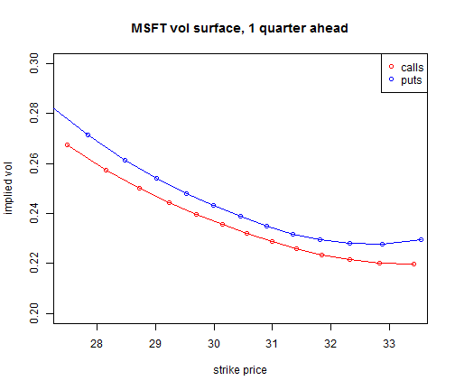
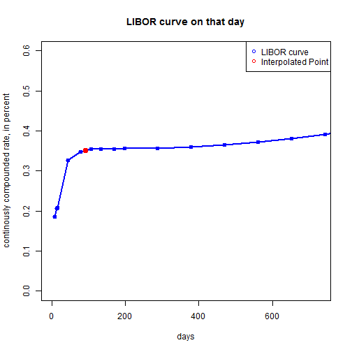
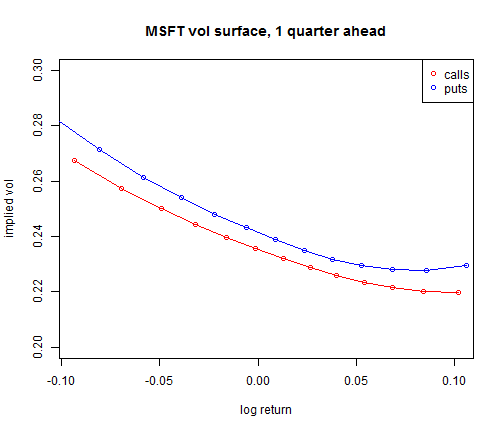

Fitting log-normal distribution to MSFT's option-implied risk-neutral distribution
========================================================

Data is for date sep-4-202. We look at the surface 1-quarter out for now. 


I. Load in data
-------------------

Load MSFT's 1-quarter-ahead implied vol surface on 9/4/2012. 


```r
volData = read.csv('msft_volSurface.csv')
volData = subset(volData, volData$days == 91, select=c('delta','impl_volatility','impl_strike','cp_flag'))
summary(volData)
```

```
##      delta       impl_volatility  impl_strike   cp_flag
##  Min.   :-80.0   Min.   :0.220   Min.   :27.1   C:13   
##  1st Qu.:-48.8   1st Qu.:0.228   1st Qu.:29.1   P:13   
##  Median :  0.0   Median :0.235   Median :30.5          
##  Mean   :  0.0   Mean   :0.240   Mean   :30.5          
##  3rd Qu.: 48.8   3rd Qu.:0.250   3rd Qu.:31.9          
##  Max.   : 80.0   Max.   :0.285   Max.   :33.5
```

Plot the implied volatilities as a function of strike. As you can see, puts are more expensive than calls (thus have higher volatilities): 

```r
with(subset(volData, cp_flag == 'C'), plot(impl_strike, impl_volatility, col = 'red', type = "o", xlab = 'strike price', ylab = 'implied vol', ylim = c(0.2, 0.3)))
title('MSFT vol surface, 1 quarter ahead')
with(subset(volData, cp_flag == 'P'), lines(impl_strike, impl_volatility, col = 'blue', type = "o"))
legend('topright', pch=1, col = c('red', 'blue'), legend = c('calls','puts'))
```

 

We need to convert the data to log-return space. Thus we need MSFT's forward price, whose computation requires the current spot price, current1-quarter-ahead interest rate, and expected dividends within 1 quarter. 

## spot price = 30.39


```r
todel = read.csv('msft_prices.csv')
spotPrice = todel$close[todel$date == 20120904]
rm(todel)
spotPrice
```

```
## [1] 30.39
```

## 1-quarter ahead (annualized) LIBOR rate = 0.35

This is the LIBOR curve on that day. Do linear-interpolation to get the corresponding rate for 1 quarter ahead. 


```r
ratesData= subset(read.csv('zero_curve.csv'), date == 20120904)
interestRate = approx(ratesData$days, ratesData$rate, 91)$y
interestRate
```

```
## [1] 0.351
```

```r
plot(ratesData$days, ratesData$rate, type = "o", xlab = 'days', ylab = 'continously compounded rate, in percent', ylim = c(0,0.6), xlim = c(0,365*2), main = 'LIBOR curve on that day', col = 'blue', lwd=2)
points(91, interestRate, col = 'red', lwd = 4)
legend('topright', pch=1, col = c('blue', 'red'), legend = c('LIBOR curve','Interpolated Point'))
```

 

Thanks to QE, interest rates in the front end are very close to the zero-bound. 

## Total dividend = \$0.23

The amount of dividends in the next quarter: 


```r
divData = subset(read.csv('msft_dividendHistory.csv'), ex_date >= 20120904, select=c('ex_date','amount'))

## get date range in yyyymmdd format
from = 20120904
to = as.Date(as.character(from),"%Y%m%d") + 91
to = 10000 * as.numeric(format(to, '%Y')) + 100 * as.numeric(format(to, '%m')) + as.numeric(format(to, '%d'))

divData = subset(divData, divData$ex_date <= to)
totalDividend = sum(divData$amount)
totalDividend
```

```
## [1] 0.23
```

## forward Price = 32.93


```r
forwardPrice = spotPrice * exp((interestRate/100) * (91/365)) - totalDividend
forwardPrice
```

```
## [1] 30.18
```

## So, convert to log-return space

Replot vol curve


```r
volData$log_return = log(volData$impl_strike/forwardPrice)
with(subset(volData, cp_flag == 'C'), plot(log_return, impl_volatility, col = 'red', type = "o", xlab = 'log return', ylab = 'implied vol', ylim = c(0.2, 0.3)))
title('MSFT vol surface, 1 quarter ahead')
with(subset(volData, cp_flag == 'P'), lines(log_return, impl_volatility, col = 'blue', type = "o"))
legend('topright', pch=1, col = c('red', 'blue'), legend = c('calls','puts'))
```

 

II. Merge and visualize data
-------------------

III. Fit a curve
-------------------

