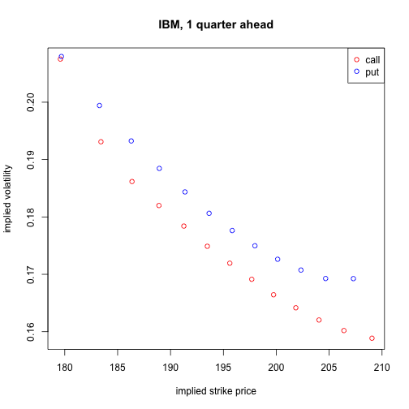

Risk-neutral density extraction procedure
========================================================


```r
sessionInfo()
```

```
## R version 3.1.0 (2014-04-10)
## Platform: x86_64-apple-darwin10.8.0 (64-bit)
## 
## locale:
## [1] en_US.UTF-8/en_US.UTF-8/en_US.UTF-8/C/en_US.UTF-8/en_US.UTF-8
## 
## attached base packages:
## [1] stats     graphics  grDevices utils     datasets  methods   base     
## 
## other attached packages:
## [1] knitr_1.6
## 
## loaded via a namespace (and not attached):
## [1] digest_0.6.4   evaluate_0.5.5 formatR_0.10   stringr_0.6.2 
## [5] tools_3.1.0
```

I demo how to extract risk-neutral density from the implied volatility surface. Data comes from optionmetrics. Extraction method heavily follows Figlewski 2010. 

## Read in data. 

Sample data is the daily vol surface of IBM and MSFT during August of 2013. 


```r
data = read.csv('sampledata_optionmetrics.csv')
data = data[,c('date','days','ticker','cp_flag','impl_strike','impl_volatility')]   # these variables are relevant
summary(data)
```

```
##       date               days      ticker     cp_flag   impl_strike   
##  Min.   :20130801   Min.   : 30   IBM :5720   C:5720   Min.   : 23.6  
##  1st Qu.:20130808   1st Qu.: 91   MSFT:5720   P:5720   1st Qu.: 32.6  
##  Median :20130816   Median :167                        Median : 96.4  
##  Mean   :20130816   Mean   :255                        Mean   :110.4  
##  3rd Qu.:20130823   3rd Qu.:365                        3rd Qu.:187.7  
##  Max.   :20130830   Max.   :730                        Max.   :248.8  
##  impl_volatility
##  Min.   :0.130  
##  1st Qu.:0.186  
##  Median :0.212  
##  Mean   :0.212  
##  3rd Qu.:0.236  
##  Max.   :0.488
```

Let's visualize the 1-quarter-ahead vol curves for IBM on the first day of Aug 2013. Note that puts are much more expensive than calls (does this not violate put-call parity?)


```r
# {r, fig.width=7, fig.height=6}
subdata = subset(data, (ticker == 'IBM') & (date == min(data$date)) & (days == 91))
with(subset(subdata, cp_flag == 'C'), plot(impl_strike, impl_volatility, col='red', xlab = 'implied strike price', ylab='implied volatility', main = 'IBM, 1 quarter ahead'))
with(subset(subdata, cp_flag == 'P'), points(impl_strike, impl_volatility, col='blue'))
legend("topright", pch = 1, col = c("red", "blue"), legend = c("call", "put"))
```

 

